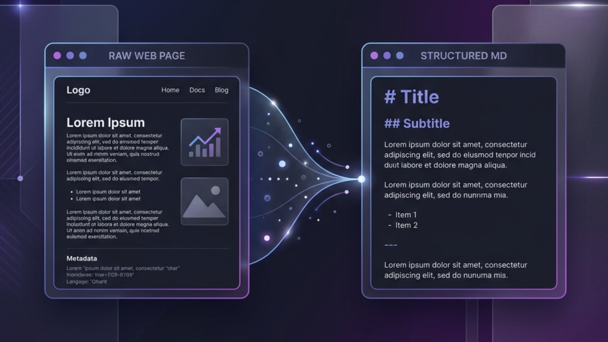

<h1 align="center">dot-md - Web to Clean Markdown</h1>

<p align="center">
  
</p>

<p align="center">
  <strong>Convert any webpage into clean, well-formatted, LLM-ready Markdown instantly.</strong>
</p>

<p align="center">
  <a href="https://github.com/fahimahammed/dot-md/actions">
    
  </a>
  <a href="https://github.com/fahimahammed/dot-md/blob/main/package.json">
    
  </a>
  <a href="LICENSE">
    
  </a>
</p>

<p align="center">
  <a href="https://github.com/fahimahammed/dot-md/releases/latest/download/dot-md.zip" style="font-weight: bold; font-size: 1.1em;">
    📥 Download Pre-built Extension (dot-md.zip)
  </a>
</p>

<p align="center">
  <a href="LICENSE">License</a> •
  <a href="PRIVACY.md">Privacy Policy</a> •
  <a href="SECURITY.md">Security Policy</a>
</p>

---

## Summary

**dot-md** is a developer-first Chrome Extension (built with Manifest V3, React, and TypeScript) designed to instantly scrape and convert cluttered webpages into clean, structured Markdown. 

Whether you are preparing article content for LLMs (ChatGPT, Claude, Gemini), archiving research, or formatting technical documentation, **dot-md** removes cookie banners, advertisements, navigation bars, and footers, delivering only the core text and images you need.

> [!IMPORTANT]
> **100% Privacy-First & Offline:** All HTML scraping, readability processing, and Markdown generation occur entirely in your local browser environment. No telemetry, no external trackers, and no server roundtrips.

---

## Features

- **Full Page Extraction:** One-click conversion of articles, blogs, and documentation pages, using Mozilla's `@mozilla/readability` to isolate the core content.
- **Custom Selection Mode:** Focus on specific page segments. Click any page element with an interactive DOM inspector overlay to extract only that section.
- **Immersive Reader Mode:** Read distraction-free in a beautiful fullscreen modal isolated inside a browser Shadow DOM. Toggle between Light, Sepia, and Dark themes, and scale typography dynamically.
- **AI-Optimized Exporter:** Instantly copy formatted templates ready for LLM prompt context, complete with page metadata (Title, Source URL, and Content).
- **Token & Word Calculator:** Live calculations of words and LLM tokens. Displays warning overlays when context length exceeds 15,000 tokens to help manage prompt budgets.
- **Local Session History:** A slide-out History panel storing your last 10 processed pages for fast offline reuse, retrieval, and re-export.
- **Premium UI/UX:** Sleek glassmorphic panel design, responsive micro-animations, customizable dark theme, and fluid transitions.

---

## Installation Guide

Follow these steps to download, build, and load the extension in your Google Chrome browser:

### Option 1: Direct Download (Easiest & Recommended for Users)
1. **Download the Extension:** Click the **[📥 Download Pre-built dot-md.zip](https://github.com/fahimahammed/dot-md/releases/latest/download/dot-md.zip)** link at the top of this page (or navigate to the **Releases** tab on the right side of GitHub and download the `dot-md.zip` file under the latest release assets).
2. **Extract the ZIP Archive:** Locate the downloaded `dot-md.zip` file on your computer and extract (unzip) its contents into a folder (e.g., name the folder `dot-md`).
3. **Load into Google Chrome:** Proceed to the **[Loading into Google Chrome](#loading-into-google-chrome)** instructions below.

### Option 2: Build from Source (For Developers)
1. **Clone the Repository:** Open your terminal and run:
   ```bash
   git clone https://github.com/fahimahammed/dot-md.git
   cd dot-md
   ```
2. **Install Dependencies & Build:** Compile the React components and packaging bundles by running:
   ```bash
   npm install
   npm run build
   ```
   *This compiles the extension assets and creates the **`dist`** directory in your project root.*
3. **Load into Google Chrome:** Proceed to the **[Loading into Google Chrome](#loading-into-google-chrome)** instructions below and load the compiled **`dist`** folder.

---

### Loading into Google Chrome

Once you have prepared the folder (either from extracting the zip or building from source), follow these steps to load it into Chrome:

1. **Open the Extensions Page:** Launch Google Chrome and navigate to **`chrome://extensions/`** by typing it directly in the URL address bar.
2. **Enable Developer Mode:** Turn on the **Developer mode** toggle switch located in the top-right corner of the page.
3. **Load the Unpacked Folder:** Click the **Load unpacked** button in the top-left corner.
4. **Select the Folder:** Browse your computer and select the extracted folder (from Option 1) or the compiled **`dist`** folder (from Option 2). *Make sure to select the folder containing the `manifest.json` file directly.*
5. **Pin and Use:** The **dot-md** extension icon will now appear in your browser toolbar. Click the puzzle icon (Extensions menu), find **dot-md**, and click the **Pin** icon for quick access. Open any article or webpage and launch the extension to begin converting!

---

## Development Installation Guide

Follow these steps to set up the project locally for development or customization.

### Prerequisites
- Node.js (v22.0.0 or higher recommended)
- npm (v9.0.0 or higher)

### 1. Clone & Install Dependencies
```bash
git clone https://github.com/fahimahammed/dot-md.git
cd dot-md
npm install
```

### 2. Available NPM Scripts
Run these commands from the root directory of the project:

| Command | Description |
| :--- | :--- |
| `npm run dev` | Runs the Vite dev server locally for interface/popup prototyping. |
| `npm run build` | Compiles files, bundles assets into `dist/`, and archives the output as `dot-md.zip`. |
| `npm run tsc` | Validates TypeScript configuration and checks for type safety compile issues. |

### 3. Understanding the Build System
Running `npm run build` triggers `node build.js`. This custom build script:
- Compiles the React UI popup, content scripts, and background service workers via Vite.
- Copies extension icons, configuration manifests, and assets to the output `/dist` folder.
- Compresses the contents of the `/dist` directory into **`dot-md.zip`** in the repository root directory. This ZIP archive is ready for upload to the Chrome Web Store Developer Console.

---

## Testing Procedures

To verify everything operates correctly:

1. **Full Extraction:** Open an article or document on dev.to or Wikipedia, click the extension icon, and verify the Markdown preview matches the content.
2. **Selection Mode:** Click the selector cursor icon in the popup. Move your cursor on the host webpage to see dashed hover highlights, select a container, and click **Load Selected** inside the popup's top banner alert.
3. **Reader Mode:** Open the reading viewer (book icon). Change text themes and sizes, then verify it closes gracefully.
4. **LLM Copying:** Click the **Export** dropdown and copy to Claude/ChatGPT format. Verify page metadata is included.

---

## Project Architecture

```txt
dot-md/
├── src/
│   ├── background/      # Chrome background service workers
│   ├── content/         # Page DOM selectors, highlighter overlay & reader mode component
│   ├── popup/           # React popup panel, Markdown previews, export utilities & history
│   ├── utils/           # Scrapers, readability parsing & turndown conversion logic
│   └── manifest.json    # Chrome Extension Manifest V3 configuration
├── public/              # Static icons and image assets
├── build.js             # Automated compilation and ZIP packaging script
├── vite.config.ts       # Vite configuration file
└── tsconfig.json        # TypeScript configuration file
```

---

## Privacy and Local Processing

**dot-md** respect user privacy.
- **No Remote Calls:** No remote APIs, analytics endpoints, or database endpoints are queried.
- **100% Offline:** Conversion and processing functions are completely offline.
- **Data Persistence:** Settings preferences and conversion histories are saved exclusively in Chrome's local storage (`chrome.storage.local`) and never leave your machine.

---

## License

This project is licensed under the terms of the MIT License. You are free to modify, distribute, and build upon this project for both personal and commercial applications. For full terms, refer to the [LICENSE](LICENSE) file.
